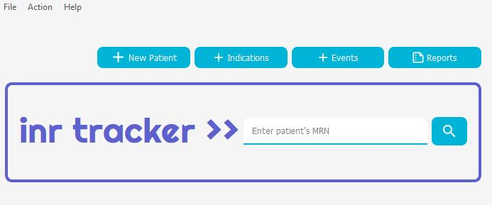

# INR Tracker

 
INR Tracker is a comprehensive management application for clinicians working or managing an anticoagulation clinic.

<h2> About the Project</h2>
In an anticoagulation clinic, clinicians track the <b>international normalized ratio</b> (INR) to determine effectiveness of 
warfarin. Warfarin is a blood thinner to prevent the formation of life-threatening blood clots. 
Most patients are on warfarin indefinitely, and will require routine monitoring of their INR with a frequency dictated 
by their level of control (e.g. weekly to every several months).  A clinic can manage dozens to hundreds of total 
patients.

When I was a pharmacist working in an anticoagulation clinic, the only support tool available was a poorly formatted 
Excel spreadsheet. I started this project with a goal to creating a comprehensive application that I wished was 
available to me during my clinical endeavors. 

<b>The INR tracker allows creation of patient profiles, logging INR values, 
and deriving meaningful metrics from that data. </b>

I hope to continue to add new features to this application, with the 
goal of improving clinician experience and improving overall patient care.

<h2>Technologies and Development</h2>
<ul>
<li>Python 3.9</li>
<li>PyQt5</li>
<li>SQLite via QtSql module</li>
</ul>

The project was developed on Windows 10 and does not follow the traditional MVC architecture. Source code has been 
split into multiple modules, organized within directories – clinic (for modules specific to clinic related functions), 
profile (modules specific to patient profiles), ui (converted from uic files), and message_boxes (module for the 
types of message boxes used in the application). 

Python packages are listed in `requirements.txt`.

<h2>How to Run</h2>
<ul>
<li>Download the repository, making sure not to change the internal file structure.</li>
<li>Setup the python packages outlined in `requirements.txt`.</li>
<li>Run main.py in the /src directory.</li>
</ul>

<h2>License</h2>
Distributed under the GNU license. See `LICENSE.txt` for more information.

<h2>Credit</h2>
Michael Miller's <a href="https://www.udemy.com/course/pyqt5-from-a-z/">PyQt5 From A-Z</a> course provided a comprehensive foundation for learning the use of the PyQt5 framework.