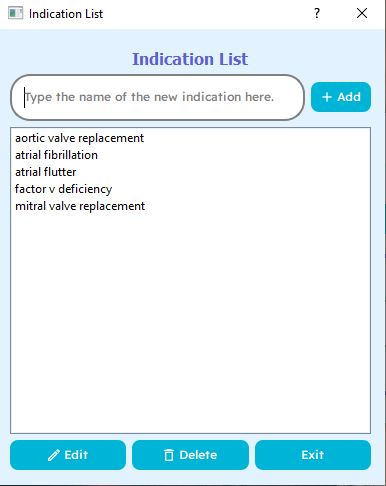

# INR_Tracker

INR Tracker is a desktop application intended to assist with the management of Anticoagulation Clinics (specifically for patients on warfarin). Overall, this application can create patient profiles, allow the input of INR results and to produce analytics from those results. All information is stored into a relational database, which allows editing and deleting of information.

Each patient has an <b>identifier</b>, which will be referred to as a medical record number (MRN). The MRN is added upon creation of a new patient profile. The MRN cannot be changed later. If an MRN is on record, the patient profile will be displayed.

<h3>Patient Profile - Summary</h3>

The patient profile is organized within two tabs: the <b>Summary</b> and <b>Results</b> tab. The summary tab will display general information, including options to edit the patient profile, export patient information to CSV or PDF, and producing patient specific analytics. 

<h3>Patient Profile - Updating</h3>

The patient profile can also be edited, with the exception of the medical record number. Note that changing the status to inactive will disable the ability to add, edit or delete results. The indication can be changed here, and new indications can be added to the database. The INR goal can also be changed here as well.

<h3>Patient Profile - Results</h3>

The Results tab will display a table of results on record. The information displayed are: Date, INR, Goal, Total Dose (in milligrams) and Comment. The INR column will be colored depending if the INR is within goal, supratherapeutic or subtherapeutic. The goal defaults to the INR goal established in the patient profile, but a different goal can be specified for any specific result. In the above example, the INR goal is 2 – 3.

<h3>Add Result</h3>

When adding a result to the patient’s profile, a dialog box will appear. The date is defaulted to the current date, but can be changed. Clicking the “No Changes” check box will prepopulate the dose with the most recent regimen on file. The INR goal will also default to the goal that has been entered for the patient, but a new INR can be specified for cases that require a goal different than the patient's normal goal (e.g. a lower goal for a procedure). A comment can be entered as well. Note that editing a result will show a similar dialog box.

<h3>Patient Analytics</h3>

Analytics can be produced if patient has at least two results on record. The TTR is calculated using the Rosendaal linear interpolation method. Other information includes total days on record, days within range, percent of days within range, total number of tests, number of tests in range, and percent of test in range.

<h3>Patient Summary PDF</h3>

A summary report can be saved for each patient. The purpose of this function is to be able to provide relevant anticoagulation information to medical facilities requesting for such information.

<h3>New Patient Profile</h3>

A new patient profile can be entered from the main menu. The Status is referring to a patient’s anticoagulation status. Examples of an inactive patient can include those who have finished treatment for an acute VTE, or those that have transferred care to another facility. By default, you can only create a patient profile with an active status. Note that the date of birth has to be entered in the YYYY-MM-DD format.

<h3>Indications</h3>

The list of indications on record can also be edited. Note that validation methods are in place to prevent duplicate entries. Best practice is to avoid abbreviations of indications.

<h3>Clinic Summary</h3>

A clinic report can be generated with certain metrics. The information can also be exported to a PDF format if desired.

